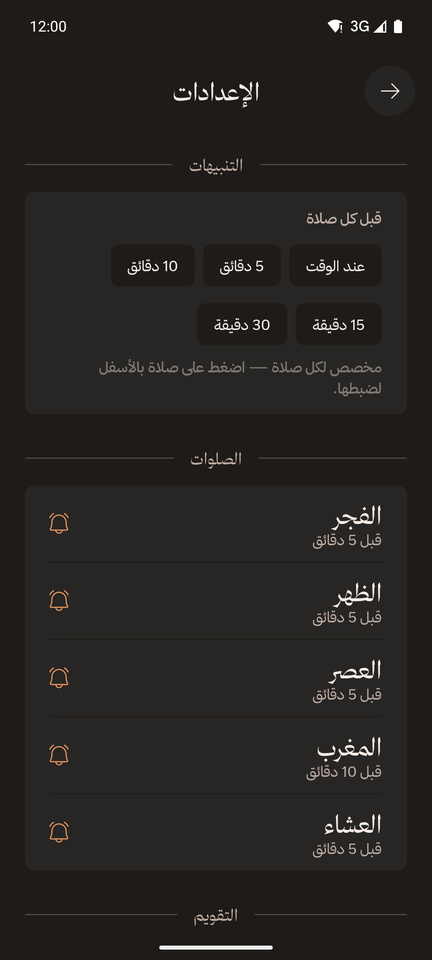
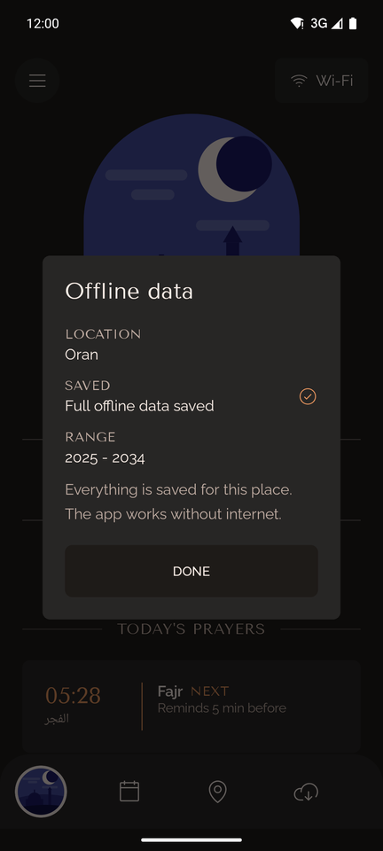

<div dir="rtl">

# منبّه الصلاة (Prayer Notifier)

[English](README.md) · **العربية**

تطبيق أندرويد هادئ يعمل دون إنترنت، يعرض مواقيت الصلوات الخمس حسب موقعك، ويعدّ الوقت المتبقي حتى الصلاة التالية، ويذكّرك قبل كل صلاة بتنبيه بسيط. يدعم العربية والإنجليزية، ويواصل العمل دون اتصال بعد حفظ المواقيت.

<p>
  
  
  
  
</p>

## المزايا

- **مواقيت الصلاة حسب موقعك**: الفجر والظهر والعصر والمغرب والعشاء، انطلاقًا من موقعك عبر GPS. يمكنك حفظ أماكن والتنقّل بينها.
- **عدّ تنازلي للصلاة التالية** مع التاريخين الهجري والميلادي. تصفّح أي يوم آخر، ثم عُد إلى اليوم بضغطة واحدة.
- **تذكيرات لا منبّهات**: تنبيه عادي بصوت هادئ قبل كل صلاة، بصياغة تطابق إعدادك («تبقّت 5 دقائق على صلاة المغرب»، أو «حان وقت صلاة المغرب» عند اختيار «عند الوقت»). اختر وقت التذكير لكل الصلوات دفعة واحدة (عند الوقت، أو قبل 5 أو 10 أو 15 أو 30 دقيقة) أو لكل صلاة على حدة، وفعّل أي صلاة أو أوقفها.
- **تعديل المواقيت**: قدّم أي صلاة أو أخّرها حتى 30 دقيقة، وعدّل التاريخ الهجري يومين زيادةً أو نقصًا، لتوافق مسجدك أو رؤية الهلال في بلدك.
- **يعمل دون إنترنت**: نزّل مواقيت 10 سنوات لمكانك، وعند انقطاع الاتصال يستخدم التطبيق ما حُفظ.
- **حالة الاتصال**: اعرف إن كنت على واي فاي أو بيانات الجوال أو دون اتصال، واضغط للتحقق من الوصول إلى خادم المواقيت.
- **العربية والإنجليزية**: واجهة كاملة من اليمين إلى اليسار بالعربية. اختر اللغة من داخل التطبيق أو من إعدادات لغة التطبيقات في أندرويد (أندرويد 13 فأحدث).
- **تصميم بروح كتاب المتحف**: ألوان داكنة دافئة، وعناوين بخط كلاسيكي، ولوحة مرسومة لكل صلاة، مستوحاة من تطبيق [Wonderous](https://wonderous.app). وتظهر شاشة افتتاحية متحركة لقصر الحمراء عند التشغيل (أندرويد 12 فأحدث).

## كيف يعمل

| الجزء | التفاصيل |
|---|---|
| المواقيت | تقاويم شهرية من [واجهة Aladhan](https://aladhan.com/prayer-times-api) المجانية (`/v1/calendar`) حسب إحداثياتك. لم تُحدَّد طريقة حساب بعد، فتُستخدم الطريقة الافتراضية للواجهة. |
| الحفظ دون اتصال | يُحفظ كل شهر تتصفّحه في قاعدة بيانات محلية (Room). وزر «الحفظ دون اتصال» ينزّل السنة الماضية والسنوات الثماني القادمة (10 سنوات، 120 شهرًا) ويتخطّى الأشهر المحفوظة مسبقًا. |
| التذكيرات | تُجدوَل عبر `AlarmManager` كتنبيهات عادية (دون واجهة منبّه ولا تنبيه بملء الشاشة). بتوقيت دقيق حين يسمح أندرويد بذلك، وإلا فإنها تصل مع ذلك وقد تتأخر بضع دقائق. ويُعاد جدولتها كل ليلة وبعد إعادة تشغيل الهاتف. |
| الموقع | قراءة واحدة لموقعك عبر Fused Location Provider، ويُسمّى المكان عبر خدمة Geocoder في أندرويد (أو بإحداثياته إن تعذّر الاسم). |
| الاتصال | الواي فاي وبيانات الجوال والإيثرنت وشبكات VPN كلها مقبولة؛ أما الشبكات العالقة عند صفحة تسجيل الدخول (captive portal) فتُعدّ غير متصلة. |

### الأذونات

| الإذن | السبب |
|---|---|
| الموقع (أثناء استخدام التطبيق) | لأن المواقيت تعتمد على مكانك. يُطلب عند أول تشغيل. |
| التنبيهات (أندرويد 13 فأحدث) | لعرض تذكيرات الصلاة. يُطلب بعد ظهور المواقيت على الشاشة. |
| التوقيت الدقيق (`USE_EXACT_ALARM`، و`SCHEDULE_EXACT_ALARM` على أندرويد 12) | يُمنح تلقائيًا لتصل التذكيرات في دقيقتها، ولا تظهر لك أبدًا شاشة إذن «المنبّهات». |
| الإنترنت وحالة الشبكة | لتنزيل المواقيت وعرض حالة الاتصال. |
| التشغيل عند بدء الهاتف | لإعادة جدولة التذكيرات بعد إعادة التشغيل. |

لا حسابات ولا إحصاءات ولا إعلانات ولا تتبّع. تُرسَل إحداثياتك فقط إلى واجهة Aladhan (لجلب المواقيت) وإلى خدمة Geocoder المدمجة في أندرويد (لتسمية المكان).

## البناء والتشغيل

المتطلبات: Android Studio (أو سطر الأوامر)، و**JDK من 17 إلى 21** (الإصدارات الأحدث لا يدعمها إصدار Gradle/AGP المستخدم)، وAndroid SDK 36. يعمل التطبيق على أندرويد 8.0 (API 26) فأحدث.

<div dir="ltr">

```sh
git clone https://github.com/abderrahmane-harouat/prayer-notifier.git
cd prayer-notifier
./gradlew :app:assembleDebug        # build the APK
./gradlew :app:testDebugUnitTest    # run the unit tests
./gradlew :app:installDebug         # install on a connected device or emulator
```

</div>

أو افتح المجلد في Android Studio واضغط **Run**.

### بناء نسخة الإصدار الموقّعة

تُوقَّع نسخ الإصدار فقط على الأجهزة التي تملك المفتاح الخاص. أنشئ ملف `keystore.properties` في جذر المشروع (مستثنى من Git) يشير إلى مخزن مفاتيح محفوظ **خارج** المستودع (الحقول: `storeFile` و`storePassword` و`keyAlias` و`keyPassword`)، ثم شغّل `./gradlew :app:assembleRelease`. ودون هذا الملف تُبنى نسخة الإصدار أيضًا لكن دون توقيع.

### تجربة تذكير (نسخ التطوير فقط)

تتضمّن نسخ التطوير (debug) أداة صغيرة تطلق تذكيرات حقيقية بالمسار نفسه للتذكيرات المجدولة دون تغيير ساعة الهاتف، وليست جزءًا من نسخة الإصدار. الأوامر في قسم [Test a reminder](README.md#test-a-reminder-debug-builds-only) من النسخة الإنجليزية.

### اختياري: خط ثمانية للعربية

صُمّمت الواجهة العربية لـ[خط ثمانية](https://font.thmanyah.com/). ترخيصه يسمح بتضمينه داخل التطبيق لكنه **يمنع استضافة ملفات الخط**، لذلك ليست موجودة في هذا المستودع. ودونها تستخدم العربية خط «أميري» المرفق، ويعمل كل شيء آخر كما هو.

للبناء بخط ثمانية:

1. نزّل الخط من [font.thmanyah.com](https://font.thmanyah.com/) (مجاني؛ يطلب الموقع بريدًا إلكترونيًا).
2. انسخ هذه الملفات الخمسة من مجلدات `otf/` إلى `app/src/main/res-licensed/font/` (مجلد مستثنى من Git) بالأسماء التالية:

   | من ملف التنزيل | احفظه باسم |
   |---|---|
   | `thmanyahserifdisplay-Regular.otf` | `thmanyah_serif_display.otf` |
   | `thmanyahserifdisplay-Bold.otf` | `thmanyah_serif_display_bold.otf` |
   | `thmanyahsans-Regular.otf` | `thmanyah_sans.otf` |
   | `thmanyahsans-Medium.otf` | `thmanyah_sans_medium.otf` |
   | `thmanyahsans-Bold.otf` | `thmanyah_sans_bold.otf` |

3. أعد البناء، وسيكتشف التطبيق الملفات تلقائيًا.

## بنية المشروع

راجع قسم [Project structure](README.md#project-structure) في النسخة الإنجليزية؛ أسماء الملفات والمجلدات هي نفسها.

باختصار: الشيفرة في `app/src/main/java/com/example/prayernotifier/` (البيانات في `data/`، والتذكيرات في `data/notifications/`، واللغة في `i18n/`، والواجهات في `ui/`)، والنصوص العربية في `app/src/main/res/values-ar/`. ومجلد `archive/` يحوي النسخة الأولى من التطبيق بـFlutter (غير مُحدَّثة).

## شكر وإسناد

- المواقيت: [واجهة Aladhan](https://aladhan.com/prayer-times-api)
- إلهام التصميم: [Wonderous](https://wonderous.app) من gskinner
- الأيقونات: [Phosphor Icons](https://phosphoricons.com) (رخصة MIT، نصّها في `app/src/main/assets/licenses/`)
- الخطوط (رخصة SIL Open Font، نصوصها في `app/src/main/assets/licenses/`): Yeseva One وTenor Sans وRaleway وأميري
- الخط العربي (اختياري، غير مرفق): [ثمانية](https://font.thmanyah.com/)

## الترخيص

الشيفرة منشورة بموجب [رخصة MIT](LICENSE) © 2026 Abderrahmane Harouat.

تحتفظ المواد المرفقة من أطراف أخرى برخصها الخاصة: الخطوط (رخصة SIL Open Font) وأيقونات Phosphor (رخصة MIT)، ونصوص رخصها في `app/src/main/assets/licenses/`. أما خط ثمانية فليس جزءًا من هذا المستودع ولا تشمله رخصة MIT.

</div>
