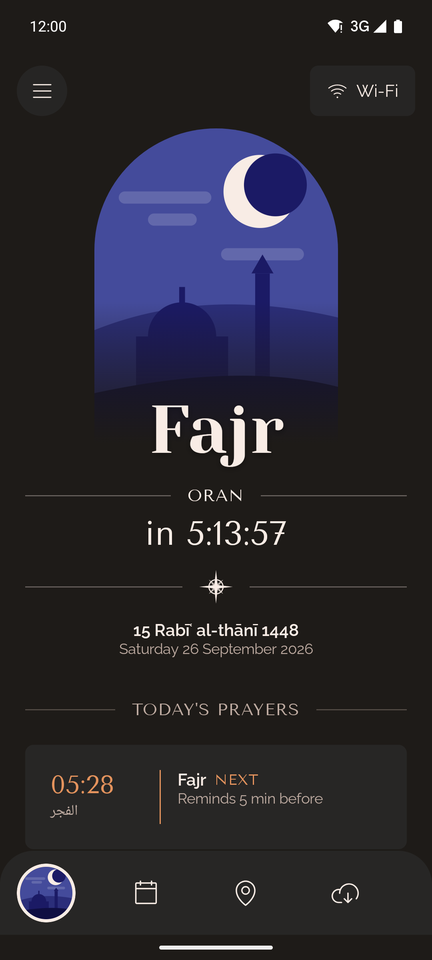
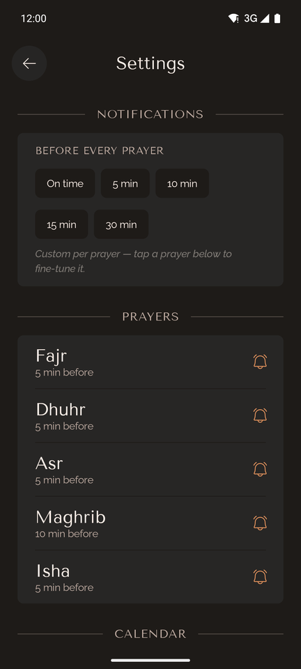
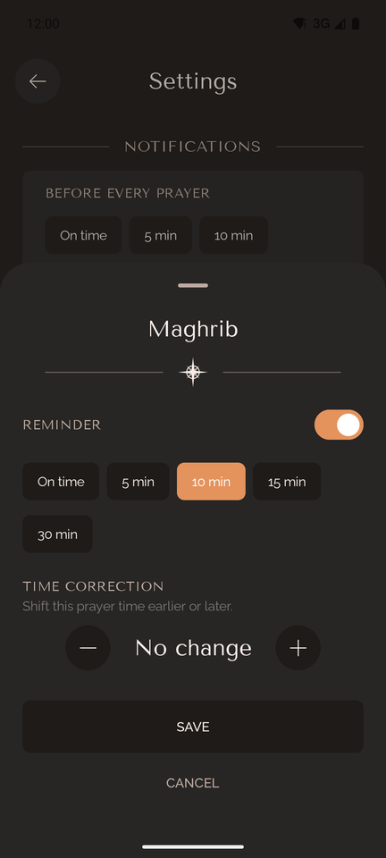
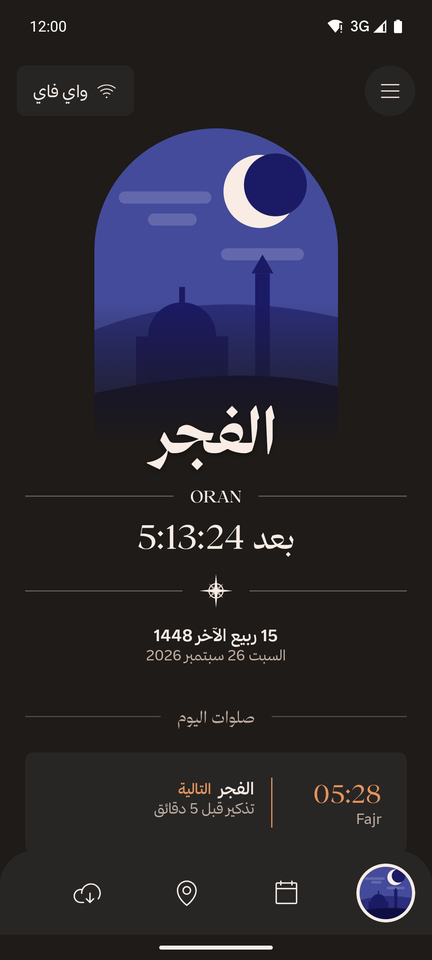

# Prayer Reminder

**English** · [العربية](README.ar.md)

A calm, offline-first Android app that shows the five daily Islamic prayer times for where you are, counts down to the next prayer, and reminds you before each one with a simple notification. It works in English and Arabic, and keeps working without internet once your prayer times are saved.

<p>
  
  
  
  
</p>

## Features

- **Prayer times for your location**: Fajr, Dhuhr, Asr, Maghrib and Isha, from your GPS position. Save places and switch between them.
- **Countdown to the next prayer**, with the Hijri and Gregorian dates. Browse any other day, and go back to today with one tap.
- **Reminders, not alarms**: a normal notification with a soft sound before each prayer. Choose the lead time for all prayers at once (on time, 5, 10, 15 or 30 minutes), or per prayer, and turn any prayer on or off.
- **Time corrections**: shift any prayer by up to ±30 minutes, and the Hijri date by ±2 days, to match your local mosque or moon sighting.
- **Works offline**: download 10 years of prayer times for a place. With no internet the app uses what is saved.
- **Connection status**: see whether you are on Wi-Fi, mobile data or offline, and tap to check that the prayer-times server is reachable.
- **English and Arabic**: full right-to-left layout in Arabic. Pick the language in the app, or in Android's per-app language settings (Android 13+).
- **A museum-book design**: warm dark tones, classical serif titles and a hand-drawn scene for each prayer, inspired by the [Wonderous](https://wonderous.app) app. An animated Alhambra splash plays on launch (Android 12+).

## How it works

| Part | Details |
|---|---|
| Prayer times | Monthly calendars from the free [Aladhan API](https://aladhan.com/prayer-times-api) (`/v1/calendar`) for your coordinates. No calculation method is set yet, so the API's default applies. |
| Offline storage | Every month you view is saved in a local Room database. "Save offline" downloads the previous year plus the next 8 years (10 years, 120 months) and skips months already saved. |
| Reminders | Scheduled with `AlarmManager` as plain notifications (no alarm-clock UI, no full-screen alert). Exact timing when Android allows it; otherwise they still arrive, possibly a few minutes late. They are re-planned every night and after a reboot. |
| Location | One GPS fix through the Fused Location Provider, named with Android's geocoder (or by its coordinates when no name is found). |
| Connectivity | Wi-Fi, mobile data, Ethernet and VPN all count; networks stuck behind a login page (captive portal) count as offline. |

### Permissions

| Permission | Why |
|---|---|
| Location (while using the app) | Prayer times depend on where you are. Asked on first launch. |
| Notifications (Android 13+) | To show prayer reminders. Asked once the prayer times are on screen. |
| Exact alarms (`USE_EXACT_ALARM`, and `SCHEDULE_EXACT_ALARM` on Android 12) | Granted automatically, so reminders arrive on the minute. Never shown to you as an "alarms" permission screen. |
| Internet / network state | To download prayer times and show the connection status. |
| Run at startup | To re-plan reminders after the phone restarts. |

The app has no accounts, analytics, ads or tracking. Your coordinates are sent only to the Aladhan API (to get prayer times) and to Android's built-in geocoder (to name the place).

## Build and run

Requirements: Android Studio (or the command line), **JDK 17–21** (newer JDKs are not supported by this Gradle/AGP version), Android SDK 36. The app runs on Android 8.0 (API 26) and later.

```sh
git clone https://github.com/abderrahmane-harouat/prayer-reminder.git
cd prayer-reminder
./gradlew :app:assembleDebug        # build the APK
./gradlew :app:testDebugUnitTest    # run the unit tests
./gradlew :app:installDebug         # install on a connected device or emulator
```

Or open the folder in Android Studio and press **Run**.

### Optional: the Thmanyah Arabic font

The Arabic interface is designed for [Thmanyah (خط ثمانية)](https://font.thmanyah.com/). Its license allows embedding it in an app but **forbids hosting the font files**, so they are not in this repository. Without them, Arabic uses the bundled Amiri font and everything else works the same.

To build with Thmanyah:

1. Download the font from [font.thmanyah.com](https://font.thmanyah.com/) (free; the site asks for an email).
2. Copy these five files from the `otf/` folders into `app/src/main/res-licensed/font/` (the folder is git-ignored), renamed as shown:

   | From the download | Save as |
   |---|---|
   | `thmanyahserifdisplay-Regular.otf` | `thmanyah_serif_display.otf` |
   | `thmanyahserifdisplay-Bold.otf` | `thmanyah_serif_display_bold.otf` |
   | `thmanyahsans-Regular.otf` | `thmanyah_sans.otf` |
   | `thmanyahsans-Medium.otf` | `thmanyah_sans_medium.otf` |
   | `thmanyahsans-Bold.otf` | `thmanyah_sans_bold.otf` |

3. Build again. The app detects the files automatically.

## Project structure

```
app/src/main/java/com/example/prayernotifier/
├── MainActivity.kt          # edge-to-edge, splash animation, language restore
├── data/                    # Aladhan API, Room cache, location, settings, connectivity
│   └── notifications/       # reminder scheduling, alarm receiver, notifications
├── i18n/                    # app language switching, Hijri month names
└── ui/
    ├── AppShell.kt          # Home ↔ Settings with animated page transitions
    ├── home/                # Home screen and its ViewModel
    ├── settings/            # Settings screen and its ViewModel
    ├── components/Wonder.kt # design system components (arch, ornaments, buttons, chips)
    └── theme/               # colors, typography (English and Arabic), shapes
app/src/main/res/
├── values/, values-ar/      # English and Arabic strings
├── drawable/                # Phosphor icons (ph_*), launcher icon, splash animation
└── font/                    # Yeseva One, Tenor Sans, Raleway, Amiri
archive/                     # the original Flutter version of the app (not maintained)
```

## Credits

- Prayer times: [Aladhan API](https://aladhan.com/prayer-times-api)
- Design inspiration: [Wonderous](https://wonderous.app) by gskinner
- Icons: [Phosphor Icons](https://phosphoricons.com) (MIT, license in `app/src/main/assets/licenses/`)
- Fonts (SIL Open Font License, licenses in `app/src/main/assets/licenses/`): [Yeseva One](https://fonts.google.com/specimen/Yeseva+One), [Tenor Sans](https://fonts.google.com/specimen/Tenor+Sans), [Raleway](https://fonts.google.com/specimen/Raleway), [Amiri](https://fonts.google.com/specimen/Amiri)
- Arabic typeface (optional, not included): [Thmanyah](https://font.thmanyah.com/)
